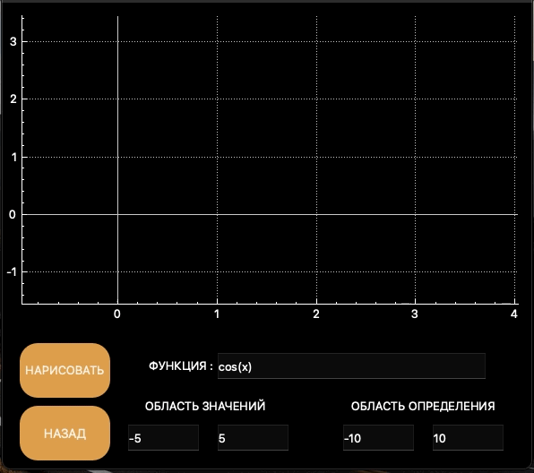

# SmartCalc v2.0


## Introduction

В данном проекте на языке программирования С++  реализована расширенная версия обычного калькулятора с использованием паттерна MVC. Помимо базовых арифметических операций, как плюс-минус и умножить-поделить, возможно вычисления арифметических выражений с учетом приоритетов, а так же некоторыми математическими функциями (синус, косинус, логарифм и т.д.). Помимо вычисления выражений калькулятор так же поддерживает использование переменной _x_ и построение графика соответствующей функции. В качестве дополнительных улучшений реализован кредитный и депозитный калькулятор.

### Паттерн MVC

Паттерн MVC (Model-View-Controller, Модель-Представление-Контроллер) представляет из себя схему разделения модулей приложения на три отдельных макрокомпонента: модель, содержащую в себе бизнес-логику, представление - форму пользовательского интерфейса для осуществления взаимодействия с программой и контроллер, осуществляющий модификацию модели по действию пользователя.


Модель хранит и осуществляет доступ к основным данным, производит по запросам операции, определенные бизнес-логикой программы, то есть отвечает за ту часть программы, которая отвечает за все алгоритмы и процессы обработки информации. Данные модели, изменяясь под действием контроллера, влияют на отображение информации на представлении пользовательского интерфейса. В качестве модели в данной программе должна выступить библиотека классов, осуществляющая вычисления калькулятора. Эта библиотека должна предоставлять все необходимые классы и методы для осуществления подсчетов. Это и есть бизнес-логика данной программы, так как предоставляет средства для решения задачи. 

Контроллер - тонкий макрокомпонент, который осуществляет модификацию модели. Через него формируются запросы на изменение модели. В коде это выглядит как некий "фасад" для модели, то есть набор методов, которые уже работают напрямую с моделью. Тонким он называется потому, что идеальный контроллер не содержит в себе никакой дополнительной логики, кроме вызова одного или нескольких методов модели. Контроллер выполняет функцию связующего элемента между интерфейсом и моделью. Это позволяет полностью инкапсулировать модель от отображения. Такое разделение полезно в силу того, что позволяет коду представления ничего не знать о коде модели и обращаться к одному лишь контроллеру, интерфейс предоставляемых функций которого, вероятно, не будет значительно меняться. Модель же может претерпевать значительные изменения, и, при "переезде" на другие алгоритмы, технологии или даже языки программирования в модели, потребуется поменять лишь небольшой участок кода в контроллере, непосредственно связанный с моделью. В противном случае, вероятнее всего, пришлось бы переписывать значительную часть кода интерфейса, так как он сильно зависел бы от реализации модели. Таким образом, взаимодействуя с интерфейсом, пользователь вызывает методы контроллера, которые модифицируют модель.

К представлению относится весь код, связанный с интерфейсом программы. В коде идеального интерфейса не должно быть никакой бизнес-логики. Он только представляет форму для взаимодействия с пользователем.


## Реализация SmartCalc v2.0


- Программа  разработана на языке C++ стандарта C++17
- Код программы  находиться в папке src
- При написании кода придерживался Google Style
- Классы должны  реализованы внутри пространства имен `s21`
- Подготовлено полное покрытие unit-тестами модулей, связанных с вычислением выражений, c помощью библиотеки GTest
- Сборка программы  настроена с помощью Makefile со стандартным набором целей для GNU-программ: all, install, uninstall, clean, dvi, dist, tests.
- Реализация с графическим пользовательским интерфейсом, на базе GUI-библиотеки Qt
- Программа реализована с использованием паттерна MVC, а также:
    - нет кода бизнес-логики в коде представлений
    - нет кода интерфейса в контроллере и в модели
    - контроллер тонкий




## Инструкции по сборке
- Для сборки программы используйте предоставленный Makefile:
```bash
make all
```
- Для установки программы(на рабочем столе появится ярлык для запуска):
```bash
make install
```
- Для удаления программы:
```bash
make uninstall
```
- Для удаления временных файлов сборки:
```bash
make clean
```
- Для просмотра документации:
```bash
make dvi
```


## Дополнительно. Кредитный калькулятор


Предусмотрен специальный режим "кредитный калькулятор":
 - Вход: общая сумма кредита, срок, процентная ставка, тип (аннуитетный, дифференцированный)
 - Выход: ежемесячный платеж, переплата по кредиту, общая выплата

## Дополнительно. Депозитный калькулятор


Предусмотрен специальный режим "калькулятор доходности вкладов":
 - Вход: сумма вклада, срок размещения, процентная ставка, налоговая ставка, периодичность выплат, капитализация процентов, список пополнений, список частичных снятий
 - Выход: начисленные проценты, сумма налога, сумма на вкладе к концу срока
